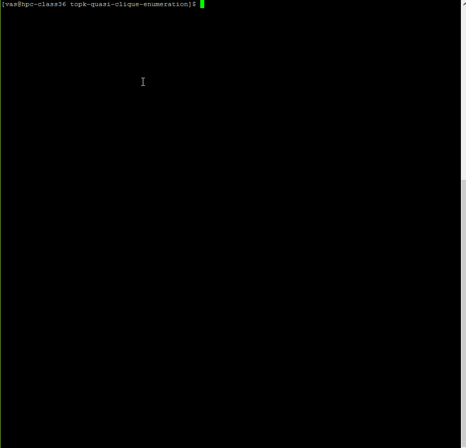

# Enumerating Top-k Quasi-Cliques
A heuristic method to enumerate top-k maximal quasi cliques.

### Abstract of our paper
  Quasi-cliques are dense incomplete subgraphs of a graph that generalize the notion of cliques. Enumerating quasi-cliques from a graph is a robust way to detect densely connected subgraphs, with applications to bio-informatics and social network analysis. However, enumerating quasi-cliques from a graph is a challenging problem, even harder than the problem of enumerating cliques. We consider enumerating top-k degree-based quasi-cliques: (1) We show that even the task of detecting if a given degree-based quasi-clique is maximal (i.e. not contained within another quasi-clique) is NP-hard (2) We present a novel heuristic algorithm kernelQC to enumerate the k largest quasi-cliques in a graph. Our method is based on identifying kernels of extremely dense subgraphs within a graph, following by growing subgraphs around these kernels, to arrive at quasi-cliques that satisfy required thresholds on degree (3) Experimental results show that our algorithm is accurate, often more than three orders of magnitude faster than the prior state-of-the-art methods, and scales to larger graphs than current methods.

You can find the longer version of this paper here: https://arxiv.org/pdf/1808.09531.pdf

# Source code

You may find the C++ implementation of our algorithm in the source folder. 

See how you can run the code.

# Build and run v1

Version v1 replaces the v0 CMake-only build with a simple `Makefile`.

```bash
make
```

The generated executable is:

```bash
./quasi_clique
```

v1 keeps the original interactive mode:

```bash
./quasi_clique
```

v1 also adds non-interactive command-line mode:

```bash
./quasi_clique <input_file> <output_file> <gamma> <gamma_prime> <k> <k_prime> <min_size> [max_runtime_seconds]
```

The optional `max_runtime_seconds` parameter enables a best-effort runtime limit. When the limit is reached, the program stops expanding the search and writes the best quasi-clique found so far.

The `exact` mode still exists:

```bash
./quasi_clique exact
```

Note that v1 checks `exact` case-sensitively.

# v0 to v1 line-by-line change summary

The original README text, demo GIF, sample input, sample output, and `source/list_top_k.cpp` / `source/list_top_k.h` are unchanged between v0 and v1. The real changes are concentrated in the build files, `source/main.cpp`, `source/load_graph.*`, and `source/quickM.*`.

v1 also contains generated build artifacts (`quasi_clique`, `source/*.o`) and an empty `build/` directory. These are not source-level algorithm changes.

## Build system

| v0 location | v1 location | Change | Impact |
| --- | --- | --- | --- |
| `CMakeLists.txt:1-16` | removed | v0 used CMake with project `quasi-clique` and target `quasi_clique`. | v1 no longer needs CMake for the normal build path. |
| absent | `Makefile:1-19` | v1 adds a direct GNU Make build using `g++`, `-std=gnu++11`, `-O3`, `-Wall`, and `-Wextra`. | Build becomes `make` / `make clean`; this is simpler, but CMake users must adapt or restore a CMake file. |

## `source/load_graph.h`

| v0 line | v1 line | Change | Impact |
| --- | --- | --- | --- |
| `35` | `35` | Existing interactive `start()` remains. | Backward-compatible interactive mode is preserved. |
| absent | `36` | Adds `start(const char*, const char*, double, double, int, int, int)`. | `load_graph` can now be initialized from command-line arguments instead of always prompting on `stdin`. |
| `36-58` | `37-59` | Existing fields and helper declarations shift down by one line. | No semantic change except the new overload. |

## `source/load_graph.cpp`

| v0 line | v1 line | Change | Impact |
| --- | --- | --- | --- |
| `13-65` | `13-65` | Existing `start_exact()` and interactive `start()` remain effectively the same. | Existing interactive workflow is preserved. |
| absent | `67-88` | Adds non-interactive `start(...)`: copies input/output paths, assigns `gamma`, `gamma_prime`, `k`, `k_prime`, and `min_size`, validates them, reads the graph, and opens the output file. | Enables scripts and batch experiments without manual prompts. Invalid parameters still terminate through `assert`. |
| `90-93` | `113-117` | Adds `adj.clear()` before rebuilding maps and counters. | Prevents stale adjacency data if `read_graph()` is called more than once on the same object. |
| `103-129` | `127-133` | Adds support for DIMACS-style problem lines beginning with `p`; v1 reads the declared vertex count from token 3 and creates vertices `1..n`. | Graphs with isolated vertices can now preserve their declared vertex count. v0 only created vertices that appeared in edges. |
| `103-129` | `134-165` | Edge parsing is generalized. v0 only accepted the first two tokens if both were numeric. v1 accepts either `u v` or DIMACS-style `e u v`. | v1 can read both the old simple edge-list format and common DIMACS edge lines. Non-numeric text lines are still ignored. |
| `120-127` | `155-162` | Duplicate-edge removal, undirected edge normalization, self-loop filtering, adjacency insertion, max-degree update, and edge counting are preserved. | Core graph-cleaning behavior remains the same. |

## `source/main.cpp`

| v0 line | v1 line | Change | Impact |
| --- | --- | --- | --- |
| `7-10` | `7-13` | Adds `<clocale>`, `<chrono>`, and `<cstdlib>`. | Supports locale-stable numeric output, steady-clock timing, and argument conversion with `atof` / `atoi`. |
| `12-35` | `15-38` | Existing `print_quasi_cliques(...)` and `print_quasi_cliques_sizes(...)` remain. | The helper functions still exist, but v1's main path no longer uses `print_quasi_cliques_sizes(...)` for final output. |
| absent | `40-56` | Adds `print_max_quasi_clique_summary(...)`. It writes `max_size`, discovery time, and vertex IDs to the output file. | Output changes from a list of top-k quasi-clique sizes plus runtime to one maximum quasi-clique summary line: `size time vertex1 vertex2 ...`. |
| `41-58` | `62-74` | Reworks `exact` mode. v0 lowercased `argv[1]`; v1 compares `argv[1]` directly to `"exact"`. v1 resets max tracking and prints the max summary. | `exact` becomes case-sensitive. `Exact` or `EXACT` worked in v0 but not in v1. Exact-mode output format changes to the new max-summary format. |
| absent | `76-89` | Adds command-line argument validation and optional `max_runtime_seconds`. | v1 supports non-interactive execution. Invalid argument counts or non-positive runtime limits return exit code `1` with a usage message. |
| `61-63` | `91-99` | v0 always prompted interactively and used `clock()` for total runtime. v1 uses CLI parameters when provided, otherwise falls back to interactive mode, then records a `steady_clock` start time. | Batch usage is possible. Runtime is now used for discovery timing and timeout checks rather than printing total runtime to the output file. |
| `66-70` | `101-106` | First-phase `gamma_prime` enumeration is preserved, with `set_runtime_limit(...)` added. | The candidate-kernel enumeration can stop early when a runtime limit is active. |
| `73-77` | `109-117` | Second-phase `gamma` expansion is preserved, with max tracking reset, runtime limit attached, and timeout checks before each expansion. | The second phase records the best quasi-clique found and can stop early. |
| `80-84` | `120-129` | v0 extracted top-k and printed only sizes plus total runtime. v1 still extracts top-k but prints `print_max_quasi_clique_summary(...)` instead. | Downstream scripts expecting v0 output must be updated. v1 emphasizes the largest quasi-clique found and its discovery time, not the full top-k size list. |
| absent | `123-127` | Adds timeout warning and fallback: if the second phase times out before finding a result, v1 prints the first-phase best result. | Produces a best-effort answer under time limits instead of leaving output empty whenever possible. |

## `source/quickM.h`

| v0 line | v1 line | Change | Impact |
| --- | --- | --- | --- |
| absent | `7` | Adds `<chrono>`. | Enables steady-clock timing inside the solver. |
| `34-38` | `35-45` | Adds public APIs: `reset_max_clique_tracking()`, `get_max_clique_size()`, `get_max_clique_time()`, `get_max_clique_vertices()`, `set_runtime_limit(...)`, and `has_timed_out()`. | `main.cpp` can query best-so-far results and control runtime limits. |
| absent | `106-113` | Adds fields for max quasi-clique tracking and timeout state. | The solver becomes stateful with respect to best result and deadline handling. |
| absent | `136` | Adds private `time_limit_exceeded()`. | Centralizes timeout checks used by search and expansion. |

## `source/quickM.cpp`

| v0 line | v1 line | Change | Impact |
| --- | --- | --- | --- |
| `11-72` | `11-80` | Constructor initializes new max-tracking and timeout fields. | New state starts from a safe default: no limit, no timeout, max size `0`. |
| `443-451` | `451-466` | `get_quasi_clique()` now stores the current size in `cur_size`, inserts it as before, and updates best-so-far size, discovery time, and vertices when `cur_size` is larger than the previous best. | v1 can report the largest quasi-clique found during the search. Ties do not replace the earlier best. |
| absent | `468-489` | Adds max-tracking reset and getter methods. | `main.cpp` can reset timing between phases and print the tracked result. |
| absent | `491-513` | Adds runtime-limit setter, timeout getter, and elapsed-time check. | Runtime limits are optional; when disabled, behavior is equivalent to no timeout checks. |
| `453-520` | `516-585` | `back_track()` now returns immediately if the time limit is exceeded and checks the limit before recursive calls. | Search can terminate early. The check happens at recursion boundaries, so actual runtime can exceed the limit slightly. |
| `523-584` | `588-650` | `extract_all_quasi_cliques()` checks the time limit in the start-node loop and before recursive search. | First-phase enumeration can stop early under a runtime limit. |
| `587-636` | `653-705` | `expand(...)` checks the time limit before setup and before recursive expansion. | Second-phase expansion can stop early and return the best result found so far. |
| `638-640` | `707-709` | `get_all_quasi_cliques()` remains functionally the same. | Existing callers can still retrieve the collected quasi-clique set. |

## Behavioral impact summary

- **Input compatibility**: v1 supports the old numeric edge-list format and adds support for DIMACS-like `p` and `e` lines.
- **Execution mode**: v1 can run interactively like v0 or non-interactively with command-line arguments.
- **Output format**: v0 writes top-k quasi-clique sizes and total runtime; v1 writes one best quasi-clique summary line: maximum size, time when that maximum was first found, then vertices.
- **Runtime control**: v1 can stop early with an optional runtime limit and return a best-effort result.
- **Algorithm core**: the pruning, candidate management, top-k filtering helper, and quasi-clique enumeration logic are mostly preserved; v1 adds tracking and timeout checks around the existing search rather than replacing the core algorithm.
- **Compatibility caveat**: scripts parsing v0 output or using case-insensitive `exact` should be updated for v1.

<p align="center">
  
</p>

If you have any question or difficulty to run the code please contact me at vas@iastate.edu.


_Disclaimer: This implementation is not the same as the implementation we used for our experiments. I changed the implementation to make it easier to understand and read for other researchers. In the original implementation, when the paramter gamma = 1, we use clique enumeration. For the sake of simplcity and convinience, we use quickM even if gamma = 1._
